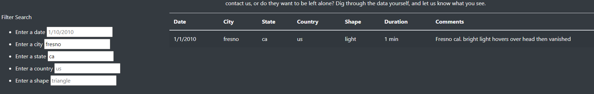

# UFO analysis

## Project overview
For this project, we created a webpage that presents a short introduction to the topic of UFO sightings, as well as data about UFO sightings. The sightings covered in 
our data set took place in the first half of January 2010 in or near various U.S. cities. Site visitors can filter the data by date, geographical location (e.g., city 
and state) and UFO shape.

## Results
When visitors first come to our site, they see our full data set with no filters applied. There is placeholder text in each of the Filter Search input boxes to show 
users how to enter values for filtering purposes.

 
 Each time we type a value into one of the Filter Search input boxes, our data automatically filters to show only the selected values. For example, if we want to see data on UFO sightings from January 10, 2010, we type "1/10/2010" into the "Enter a date" input box. This replaces the placeholder text. 
 
 

We can apply other filters as well. For example, to further narrow down the January 10, 2010, data to only sightings that happened in Fresno, California, we type 
"fresno" and "ca" into the relevant input boxes.

## Summary
The limitations of the UFO sightings data set are not immediately apparent to site visitors. We allow users to enter any date, city, state, country or shape, but data is 
available for a very limited range of dates, geographies and shape types. For example, since there is no non-U.S. data, it is arguably a waste of visitors' time to 
have an input box for country. We should remove the country input box until such time as our data is more geographically varied. 

Site visitors could also benefit from having drop-down selections for other input boxes. This would cut down on the amount of time they spend blindly entering, for 
example, names of cities and states, in the hopes of finding relevant data. It could also avoid the confusion that arises if site visitors type their inputs in an 
unexpected way (e.g., "CA" or "California" instead of "ca").

The placeholder values in the input boxes might also be confusing for site visitors. If we made the placeholder text lighter or rewrote it to make its purpose clear 
("e.g., 1/10/2010" instead of just "1/10/2010"), this could improve the user experience.
